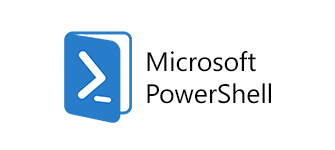

# POWERSHELL Work : Impressions & Avis personnel
---

**Autoproduction d'un support de cours, capacité à s'organiser, prise de notes et relevé d'informations**

Ce sujet m'a permis de travailler ma capacité à m'organiser, à créer un compte-rendu de qualité, utile pour mon apprentissage et celui des autres. Il m'a permis d'avoir un automatisme sur la prise de note , relevé d'informations essentielles et de moins en attendre de la part des autres, faire par soi-même plutôt qu'en attendre de l'autre. Cette une méthode d'apprentissage que je n'avais pas rencontré ou très peu, globalement je n'en retire que du positif : capacité à s'organiser , à récupérer des informations puis à les retranscrirent, autonomie, prise d'initiative. Une pédagogie approuvée, un sujet plus qu'intéressant qui méritait d'être traitée avec sérieux. Ce travail m'a permis d'en apprendre plus sur le fonctionnement de PowerShell, de Windows, de Linux, de l'utilisation de Git, j'ai découvert le language Markdown (.md) également, un travail riche en connaissance qui en valait la peine d'être travaillé.

