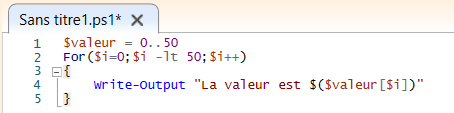
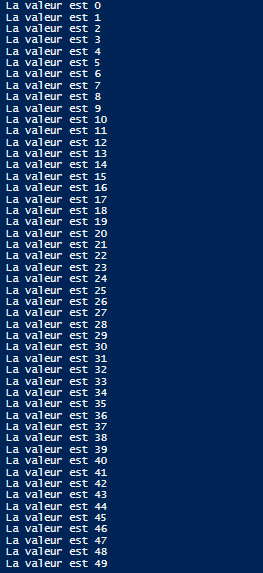
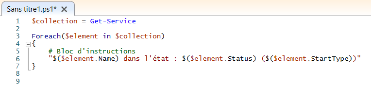
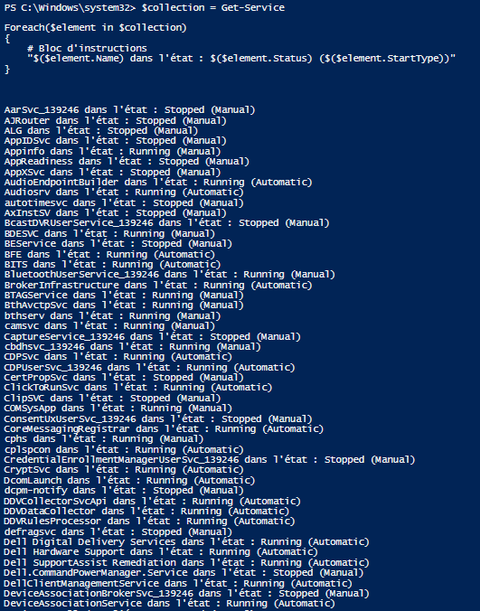
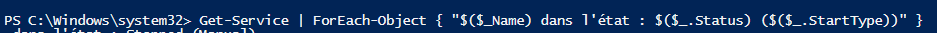
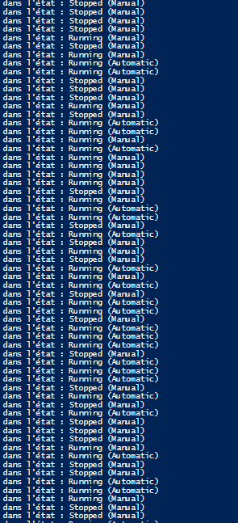

# LES BOUCLES

Une boucle est une structure répétitive qui permet d'exécuter plusieurs fois les instructions se trouvant à l'intérieur du bloc d'instruction.

---

**1.** Les Boucles **FOR**  

>La boucle for est une structure de contrôle de programmation qui permet de répéter l'exécution d'une séquence d'instructions.


*FONCTIONNEMENT* : 
```
For(<état initial>;<condition de répétition>;<incrémentation>)
{
    <Si condition est vraie, alors le bloc d'instructions s'exécute>
}

<Or, si la condition est fausse, la boucle for s'arrête et le script continue>
```

Pour qu'une boucle **for** soit fonctionnel, il faut saisir une valeur de départ (**état initial**), une valeur cible dans la **condition de répétition**, et une **incrémentation** qui aura effet sur la valeur a chaque tour de boucle. On peut incrémenter de 2,4,5,10,20, il n'y a pas de limite.

*EXEMPLES*  :




1. On donne la veule initial de 0 à la variable **i** .
2. On donne la condition de répétition.
3. On donne l'incrémentation qui est d'ajouter **1** a chaque tour.


**Voici le résultat de la boucle *for***



---

**2.** Les Boucles **ForEach**

> La boucle foreach est utilisée pour simplifier le parcours des tableaux ou des listes.

*FONCTIONNEMENT* : 

Il existe deux syntaxes :

- **1** << script bloc >>
```
Foreach(<élément> in <collection>)
{ 
    # bloc d'instructions / traitement
}
```

**élément** - variable qui va prendre pour valeur chaque objet à traiter de la collection de données
**collection** - variable qui regroupe l'ensemble de valeurs.
**bloc d'instruction** - c'est l'ensemble des actions à réaliser à chaque tour sur l'objet concerné.


- 2 << pipeline >>

```
Get-Service | Foreach-Object { "$($_.Name) dans l'état : $($_.Status) ($($_.StartType))" 
}

```
*Cette syntaxe tient sur qu'une seule ligne elle est donc parfaite pour être exécutée sur PowerShell. La commande **Get-Service** va envoyer sa "**collection**" d'objets à la boucle **Foreach-Object** qui va traiter chaque objet.*

---
*EXEMPLES*

**1.** << *bloc script* >>




>***ps: ne pas prêter attention a "# Bloc d'instructions"***

* `$collection = Get-Service` **-->** on déclare la variable `"$collection"`, on va lui affecter la valeur Get-Service. La variable `$collection` va donc prendre pour valeur la liste de nos services présent sur la machine windwows.

* `Foreach($element in $collection)` **-->** on va parcourir chacun des services présent dans notre collection de données ce qui va nous permettre de réaliser des actions sur chaque éléments. Les actions sont déterminés dans le bloc d'instrcution. Chaque élément correspond donc à un seul objet de notre collection. On va répéter la boucle jusqu'a arriver a la fin de la collection.

* `"$($element.Name) dans l'état : $($element.Status)` `$($element.StartType))"` **-->** affichage du **nom de service** suivie de la phrase "**dans l'état :**", son statue et son **mode de démarrage**.
  



**2.** << *pipeline* >>

***deuxième façon de faire...***

Grâce a la pipeline le script n'est plus qu'une commande puisqu'elle tient sur une une seule signe ce qui est plus pratique.


1. Exécution de la commande.
   


> ***La collection de données*** *à traiter et passée à la boucle ForEach au travers d'un pipeline (<< **|** >>)*

>***Les données*** *sont récupérées grâce à la variable automatiquement :* **$**

* `Get-Service | Foreach-Object` **-->** La commande "Get-Service" va donner pour résultat l'état, le mode de démarrage et le nom des services. Grâce a **pipeline** le résultat de la 1*ere* commande va être envoyé à la deuxième : " *Foreach-Object* ". Grâce à la deuxième commande on aura un résultat pour chaques objets. 

* `$($_.Name) dans l'état : $($_.Statue ($($_.StartType))` **-->** On va pouvoir récupérer un nom d'un objet envoyé par **Get-Service** grâce à `$_.Name`. Sera suivie de la phrase " ***dans l'état :*** " puis du statue du service avec `$_.Status` et pour finir du mode de démarrage avec `$_.StartType`.

La variable automatique "**`$_`**" remplace "**`$element`**".

2. Résultat après exécution de la commande.



---
.
<br/>
<br/>
<br/>
<br/>
<br/>
[6.](https://github.com/Anescoo/Linux/blob/main/Script.md)