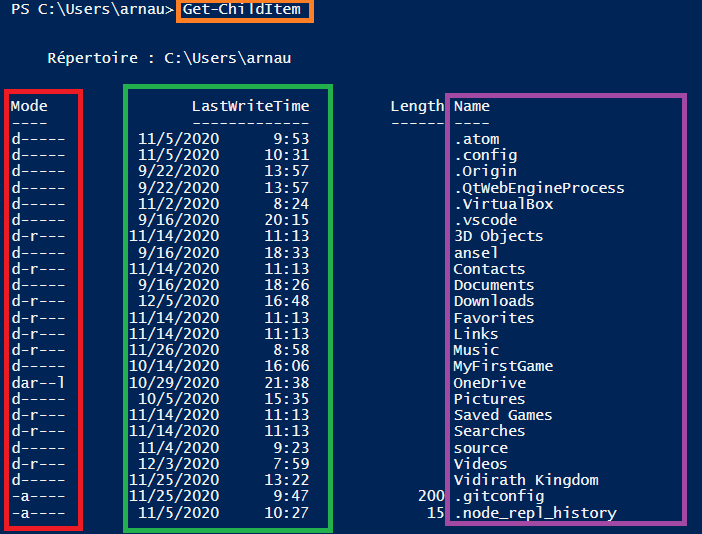
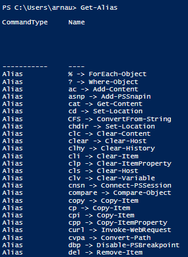
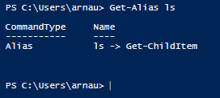
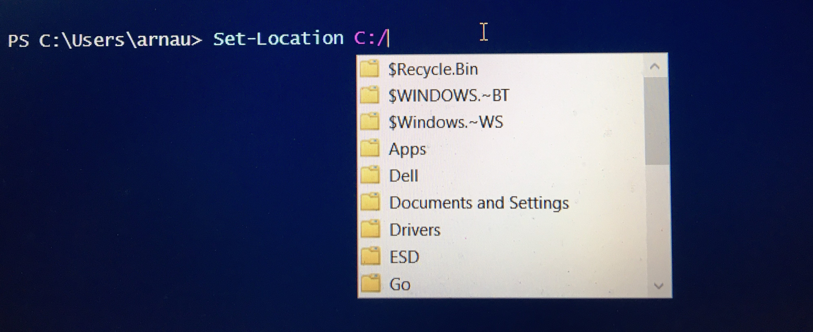
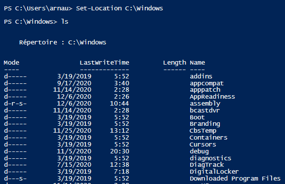

## LES COMMANDES

  - >Get-Childltem  
      -  Lorsque la commande est exécuté, elle indique plusieurs informations sur les objets listés (Nom, Date de dernière modification, etc...)
            

        En Orange : Exécution de la commande
        En Rouge : Les permissions 
        En Vert :  Les dates des dernières modifications
        En Violet : Le nom des objets (archive, répertoire)  
  - >Get-Alias
      - Lorsque la commande est exécuté, toute la liste des alias existant sur votre système s'affiche.
            
    
    -  Vous pouvez connaître l'alias d'une commande en particulier, ex : **Get-Alias ls**

        

- >Set-Location *(Chemin)*
    - Set-Location *(Se déplacer dans le répertoire de son choix)*
    - Exemple 1 : Set-Location C:\Windows *(déplacement vers le répertoire **C:\Windows**)*

        
