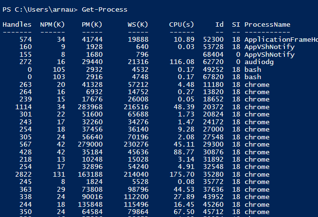
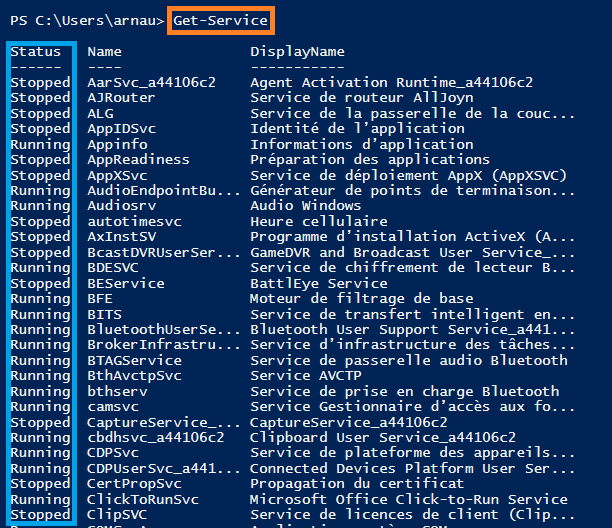
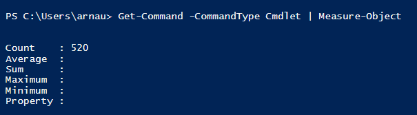
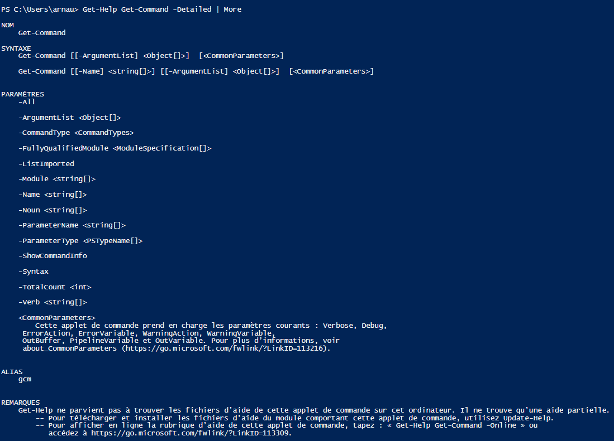
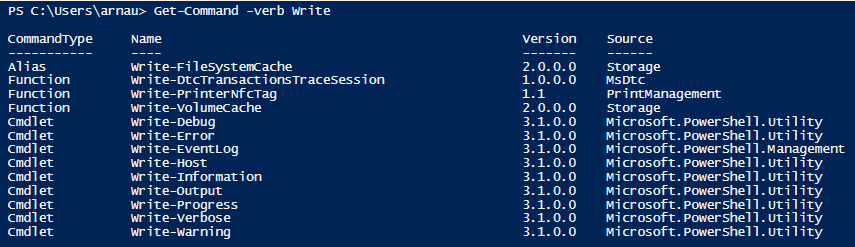
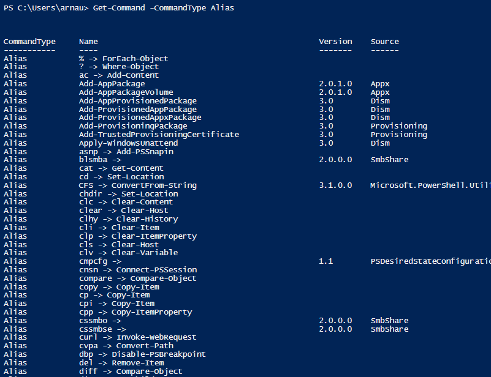
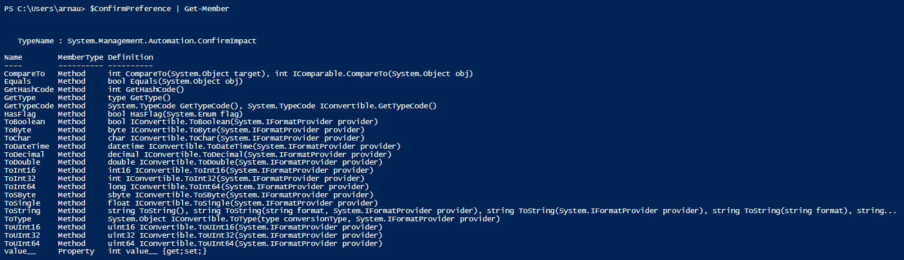
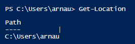

## LES COMMANDES

   - >Get-Childltem  
      -  Lorsque la commande est exécuté, elle indique plusieurs informations sur les objets listés (Nom, Date de dernière modification, etc...)
            
        ```
        En Orange : Exécution de la commande
        En Rouge : Les permissions 
        En Vert :  Les dates des dernières modifications
        En Violet : Le nom des objets (archive, répertoire) 
        ```
 ---        
  - >Get-Alias
      - Lorsque la commande est exécuté, toute la liste des alias existant sur votre système s'affiche.
            
    
    -  Vous pouvez connaître l'alias d'une commande en particulier, ex : **Get-Alias ls**

        
---
- >Set-Location *(Chemin)*
    - Set-Location *(Se déplacer dans le répertoire de son choix)*
    - Exemple 1 : Set-Location C:\Windows *(déplacement vers le répertoire **C:\Windows**)*

        

---
- >Get-Process 
  - Lorsque la commande est exécuté, elle permet de récupérer la liste des processus actif sur votre système.

    
    - Début de la liste des processus actif sur le système


---
- >Get-Service
  - Permet de récupérer la liste des services Windows sur votre système. 
        
  
    ```
    En Orange : Exécution de la commande
    En Bleu : Statue du service Windows (A l'arrêt/ En fonctionnement)
---
- >Get-Command
  - Affiche toutes les commandes PowerShell
---
- >Get-Command CommandType Function 
  - Affiche toutes les fonctions PowerShell
  
 ---

 - >Get-Command -CommandType Cmdlet | Measure-Object
    - Affiche le nombre de commandelettes disponible pour PowerShell

        

        
        **Les cmdlets:** 
        Les commandes PowerShell sont constituées d'un **verbe** ou d'un **préfixe** et d'un nom séparés par un tiret. Elles peuvent être suivies de paramètres. On les appelle des **commandlets pour** *command applets*.

---


- >Help Get-Command || Get-Help Get-Command
     - Commande pour avoir de l'aide sur une commande
 ---
- >Get-Help Get-Command -Detailed | More
    - Commande pour avoir de l'aide détaillé sur une commande
    

---

- > Get-Help Get-Command -Full | More 
  - Aide complète sur une commande 
  
---

- >Get-Command -verb (Set, Get, Get*, Write)
  - Permet d'obtenir la liste des commandes en spécifiant le verbe listé en paramètre
  - ex : Get-Command -verb Write

     
---
-  >Get-Command -Noun (Item, Oject, Obj*, *Item)
   -  Permet d'obtenir la liste des commandes dont le nom commence par le nom listé en paramètre :
  
---

- > Get-Command -CommandType 
    - Permet d'obtenir la liste des commandes dont le type est le suivant. *(Alias, Function, Cmdlet, Externalscript, Application)*
    -  **ex** : Get-Command -CommandType **Alias**

        
---
- > Get-Member
  - **Get-Member** -> permet d'obtenir la liste des méthodes applicable à un objet.
  - **ex** : $ConfirmPreference | Get-Member
  
    

---
- >Variables
```
$TestVariable = Déclaration de variable 
$TestVariable.GetType() = Obtenir le type de l'objet
$TestVariable.ToUpper() = Mettre la valeur en majuscule
$TestVariable.Length = Afficher le nombre de caractère
```

---

- >Get-Location 
  - Permet d'afficher le répertoire courant à l'identique de la commande "pwd" existante sous Linux.

    
---

- >New-Item 
  -  *Permet de créer des répertoires* : 
   **New-Item -Item Type directory -Name 'PowerShellWork' -Path**
  - *Permet de créer des fichiers* :
   **New-Item -Name PWShell.txt -ItemType file -Value 'Voici mon travail' -Path 'C:\Users\arnau\Documents\PowerShellWork'**

---

 - >PipeLine = "  **|**  "
    - pipeline permet la liaison entre deux commandes, cela permet de filtrer les données, affiner un résultat
--- 

--
<br/>
<br/>
<br/>
<br/>
<br/> 
 [8.](https://github.com/Anescoo/Linux/blob/main/Source.md)