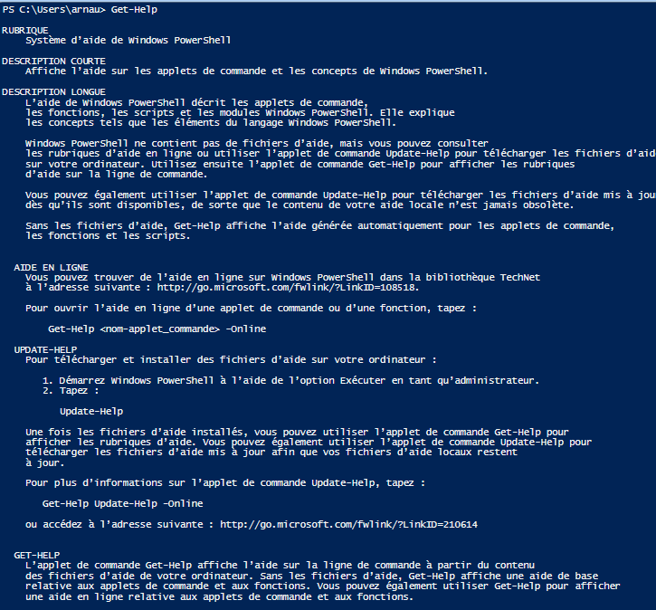
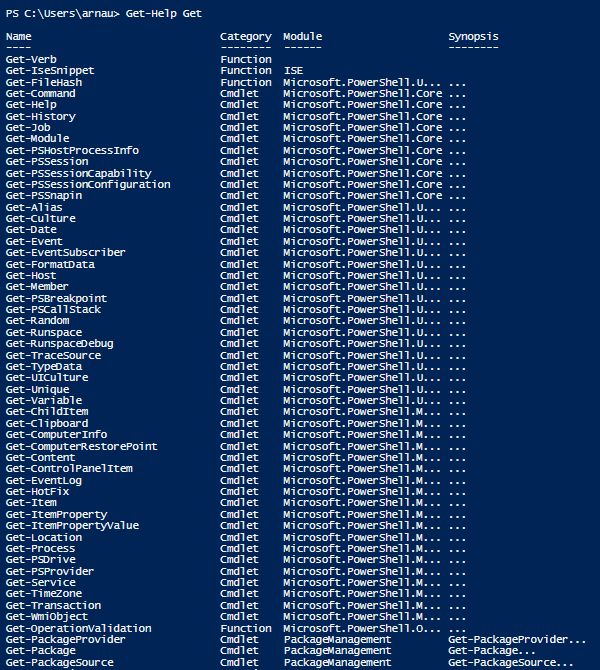
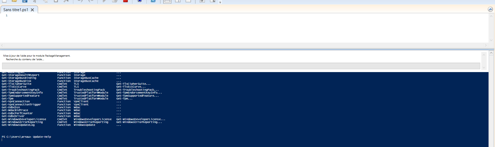

# Les commandes d'aide Powershell

>Get-Help

- Une fois la commande exécuté on obtient ce descriptif, qui permet d'avoir un rapide aperçu de powershell, et de comment obtenir de l'aide. 
  
  
  
  
---
Par ailleurs on peut toute fois précisé la commande pour poussé la recherche, et donc avec une réponse précise.

>Get-Help "nom de la commande"

* ex: **Get-Help *Get***
* En exécutant la commande j'obtiens donc la liste des commandes commençant par le même argument "**Get**"

---

>Update-Help 

* Cette applet de commande télécharge les derniers fichiers d'aide pour les modules PowerShell et les installe sur votre ordinateur (rédémarrage du poste non nécessaire)
* A son exécution : 

*en effet on remarque le téléchargement de fichier*

---
9. [Scripts](https://github.com/Anescoo/Linux/blob/main/Script.md) (page suivante) 