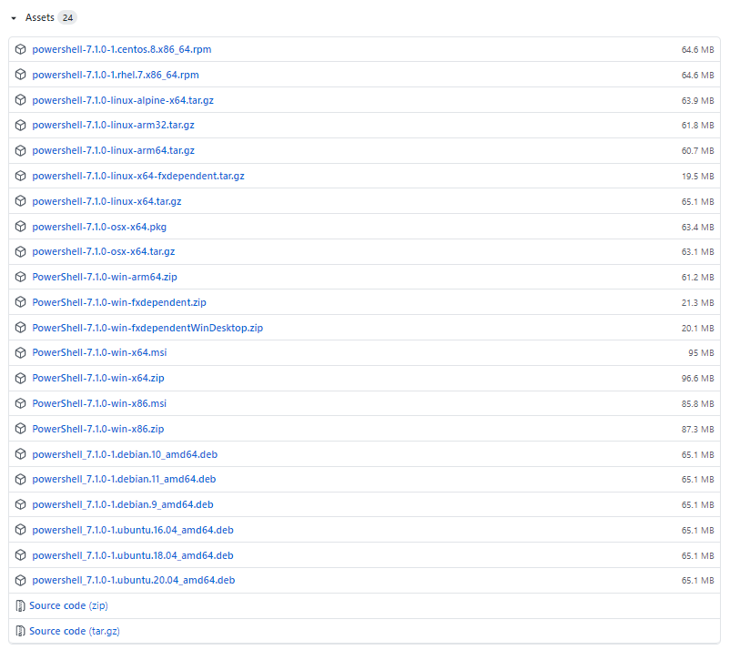

# L'installation de PowerShell sous Linux (debian 10 - VM) : 
---
1. **Télécharger du répertoire clés GPG de Microsoft**
- wget https://packages.microsoft.com/config/debian/10/packages-microsoft-prod.deb
</ul>

2. **Insérer le répertoire clés GPG de Microsoft**
- sudo dpkg -i packages-microsoft-prod.deb
</ul>

3. **Mettre à jour la lise des produits**
- sudo apt-get update 

4. **Installer PowerShell**
- sudo apt-install -y powershell

5. **Lancer Powershell**
- pwsh
---

# L'installation de PowerShell sous Windows

1. **Cliquer sur le lien github**

- https://github.com/PowerShell/powershell/releases

2. **Une fois sur github, aller tout en bas de la page, rubrique *(assets)***

3. **Une fois dans la rubrique *"Assets"*, il faut choisir la version adapté à votre windows**

- `Windows x64 bits:` Il faut cliquer sur celui la pour télécharger la version adaptée : [PowerShell-7.1.0-winx64.msi](https://github.com/PowerShell/powershell/releases)
- `Windows x32 bits:` Il faut cliquer sur celui la pour télécharger la version adaptée : [PowerShell-7.1.0-win-x86.msi
](https://github.com/PowerShell/PowerShell/releases/download/v7.1.0/PowerShell-7.1.0-win-x86.msi)

4. **Une fois que le téléchargement (dans le naviguateur) sera terminé il ne restera plus qu'a suivre les différentes étapes indiquées à l'écran.**
---
 **Votre PowerShell est prêt à l'emploi**