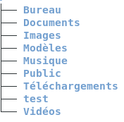

 # LINUX

             

 **- Bureau :** Un bureau est une interface de travail, un menu pour accéder à des fichiers et des applications. 

 **- Documents :**  Il permet à un utilisateur quelconque de stocker des documents (fichiers).

 **- Images :**  Il permet a un utilisateur quelconque de stocker ses photos ou images en tout genre enregistré depuis le web.

 **- Modèles :** Un modèle a pour objectif de structurer les informations et activités d'une organisation : données, traitements, et flux d'informations entre entités.

**- Musique :** Dossier permettant à un utilisateur de stocker ses musiques.

**- Public :** Dossier accesible par tout le monde donc publique. Fichiers accessibles à toutes utilisateurs d'un poste.

**- Téléchargements :** Dossier des fichiers téléchargés via les navigateurs web.

**- Test :** Dossier créé par l'utilisateur pour stocker ses fichiers tests.

**- Vidéos :** Dossier permettant à un utilisateur de stocker ses vidéos personnels ou vidéos téléchargés sur le web.

