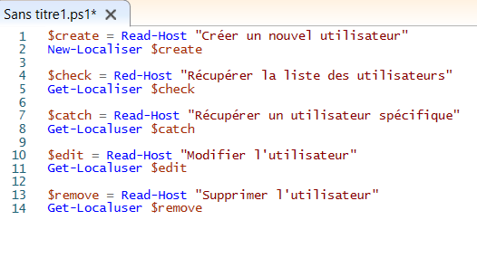
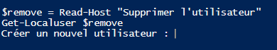
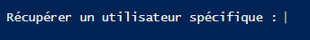

# Définition

* En informatique, un script désigne un programme (ou un bout de programme) chargé d'exécuter une action pré-définie quand un utilisateur réalise une action ou qu'une page web est en cours d'affichage sur un écran. Il s'agit d'une suite de commandes simples et souvent peu structurées qui permettent l'automatisation de certaines tâches successives dans un ordre donné.  


---

# TP

### script de gestion d'utilisateurs :


>1




``` Read-Host ``` : Va nous permettre d'inviter un utilisateur, et d'affecter toutes actions concernant la gestion d'utilisateur : Modifier, Créer, Supprimer, Ajouter, etc...

``` Get-Localuser ``` : Cette cmdlet obtient les comptes d'utilisateurs intégrés par défaut, les comptes d'utilisateurs locaux créés, et les comptes locaux connectés aux comptes Microsoft.

***explication du script***
- Il y a 5 variables pour 5 options: Créer(`$create`), Récupérer la liste des users(`$check`), Récupérer un user spécifique(`$catch`), Modifier(`$edit`), Supprimer(`$remove`).
- En premier lieu on va créer une variable ex: `$create`, on va ensuite ajouter la commandlets **Read-Host** pour affecter une action à notre variable, cette variable quand à elle aura plusieurs possibilité d'intéraction avec les utilisateurs que j'ai obtenu grâce à la commandelets **Get-Localuser**.
- Une fois le script exécuté un message s'affiche pour indiqué quoi saisir, s'il s'agit de modifier, de supprimer, ou d'ajouter tel ou tel utilisateur.

>2

 - Une fois la première partie du script exécuté concernant la création d'un nouvel utilisateur, le message ci-dessous apprait :

    

>3

- Une fois la deuxième partie et troisième partie du script exécuté concernant la récupération d'un utilisateur spécifique et de la liste d'utilisateurs en général, on obtient ce message :

    


>4

- Une fois la quatrième partie du script exécuté concernant la modification d'un utilisateur, ce message s'affiche : 

    

>5

- Une fois la cinquième et dernière partie du script exécuté concernant la supression d'un utilisateur ou des utilisateur, ce message ci s'affiche :

    

---
13.  [Avis personnel & Impressions](https://github.com/Anescoo/Linux/blob/main/Avis.md) (page suivante) 