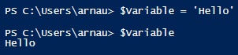
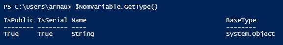
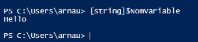
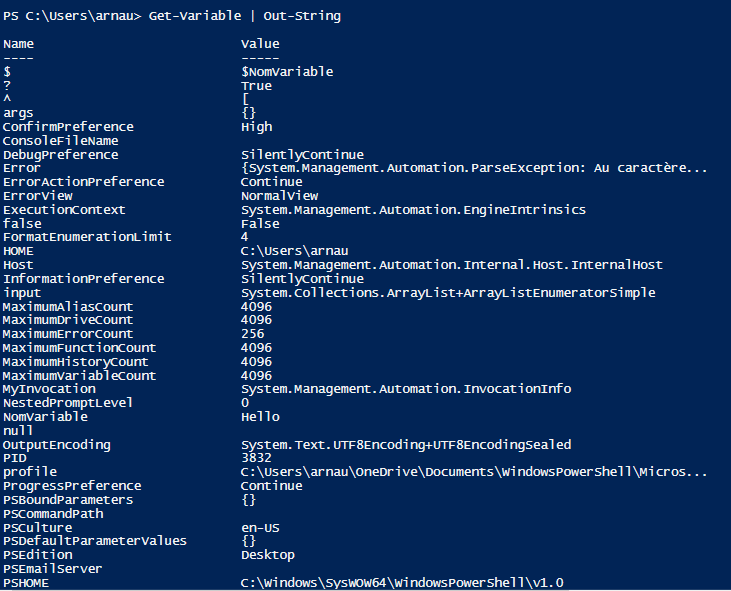
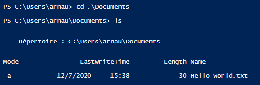

# LES VARIABLES

>- Définition

  
  Dans un language de programmation, une variable est un espace de stockage pour un résultat. Cependant les possibilités d'une variable sont intimement liées au language de programmation auquel ont fait référence. Par exemple une variable en C++ aura six caractéristiques : 
  
  - **son nom** : sous quel nom est déclaré la variable.
  - **son type** : c'est la convention d'interprétation de la séquence de bits qui constitue la variable. 
  - **sa valeur** : c'est la séquence de bits elle-même.
  - **son adresse** : c'est l'endroit dans la mémoire où elle est stockée.
  - **sa visibilité** : c'est un ensemble de règles fixe qui peut utiliser la variable. (public, private, protected).
  - **sa durée de vie** : c'est la portion de code dans laquelle la variable existe.
---
>- Les Types
  
  Ils existent de nombreux types de variable : 

- **string** : Chaîne de texte
- **int** : Nombre entier *32 bits*
- **char** : Symbole
- **bool** : Booléen (la valeur peut être *true* ou *false*)
- **long** : Nombre entier *64 bits*
- **decimal** : Nombre décimal *128 bits* avec la lettre « d » à la fin
- **double** : Nombre décimal à virgule flottante de *8 octets*
- **single** : Nombre décimal à virgule flottante de *32 bits*
- **DateTime** : Date et heure
- **array** : Tableau (décrit en détail plus loin dans l’article)
- **hashtable** : Table de hachage

---

- **$NomVariable** = 'Hello'
    - déclaration de variable

        
---
- **$NomVariable.GetType()**
  - pour connaitre le type de la variable

    
---
- **[type]$NomVariable** = 'Hello'
  - forcer le typage d'une variable
  
    

---

- **Get-Variable | Out-String**
  - Afficher les variables
  
    

---
    Pour Imprimer une variable :

1. *Enregistrer dans un un fichier .txt*
- **$var5 = "Hello World!"**
- **$var5 | Out-File C:\scripts\Hello_World.txt**
>J'enregistre dans le fichier texte avec le chemin indiqué
 

>Je me déplace dans le dossier **Documents** et je constate la présence du fichier **.txt** (nommé *"Hello_World"*)

2. *Enregistrer dans un ficher .csv*
- **$var6 = Get-Process**
- **$var6 | SELECT Name, Path |Export-Csv -Path C:\scripts\processes.csv**

Pour lire un fichier que vous avez exporté
- **Get-Content C:\scripts\processes.csv**

---
    Pour Effacer une variable

- **Clear-Variable -name var6 #without $**

---
    Supprimer une variable
- **Remove-Variable -name var6 #without $**

---